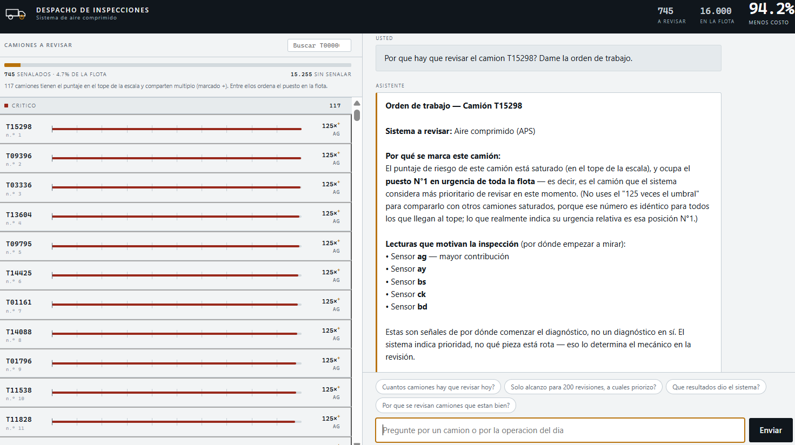

# Agente de diagnóstico APS

**Priorización automatizada de inspecciones de mantenimiento con un agente construido sobre la API de Claude.**

Un taller de flota no puede revisar todos sus vehículos, y tampoco puede permitirse ignorarlos. Este proyecto construye un sistema que decide **a qué equipos enviar un técnico** antes de que fallen, y una capa conversacional que pone esa decisión al alcance de quien organiza el trabajo del día.

Sobre 16.000 vehículos no vistos durante el entrenamiento, el sistema **reduce el costo de mantenimiento en un 94,2 %** frente a la práctica correctiva.



---

## Índice

- [El problema](#el-problema)
- [Resultados](#resultados)
- [El agente sobre la API de Claude](#el-agente-sobre-la-api-de-claude)
- [Cómo está organizado](#cómo-está-organizado)
- [Decisiones metodológicas](#decisiones-metodológicas)
- [Lo que este sistema no puede afirmar](#lo-que-este-sistema-no-puede-afirmar)
- [Qué se transfiere a otras operaciones](#qué-se-transfiere-a-otras-operaciones)
- [Instalación paso a paso](#instalación-paso-a-paso)
- [Cómo usarlo](#cómo-usarlo)
- [Del piloto a la operación](#del-piloto-a-la-operación)

---

## El problema

El sistema de aire comprimido (APS) de un camión pesado alimenta los frenos de servicio y asiste el cambio de marchas. Cuando falla en ruta, el vehículo queda inmovilizado: carga detenida, conductor sin operar, grúa y taller de urgencia.

Los dos errores posibles no cuestan lo mismo:

| Error | Costo |
|---|---|
| Inspeccionar un equipo sano | **10** |
| No detectar una falla que luego ocurre | **500** |

Esa razón de **50 a 1** es el eje del proyecto. Conviene inspeccionar hasta cincuenta equipos sanos con tal de encontrar uno averiado, y por eso el sistema no se evalúa con métricas de clasificación sino directamente en unidades de costo. La pregunta que responde no es "cuántos aciertos tuvo" sino **cuánto dinero ahorra frente a la práctica actual**.

## Resultados

Evaluación sobre 16.000 vehículos que no intervinieron en ninguna etapa del entrenamiento ni en la elección del umbral de decisión.

| | |
|---|---|
| Costo del mantenimiento correctivo | 187.500 |
| Costo con el sistema | **10.840** |
| Reducción | **94,2 %** |
| Fallas detectadas | 361 de 375 (96,3 %) |
| Inspecciones ordenadas | 745 (4,7 % de la flota) |
| Inspecciones por falla detectada | **2,1** |

Ese último número resume el aporte: la estructura de costos permite pagar hasta 50 inspecciones por falla encontrada, y el sistema lo consigue con 2,1.

## El agente sobre la API de Claude

El modelo produce un puntaje y un archivo. El agente es lo que convierte eso en algo que un jefe de taller usa al empezar el turno.

Atiende preguntas en lenguaje natural —cuántos equipos revisar, por qué ese en concreto, a cuáles priorizar si solo hay capacidad para doscientos, qué responder a un técnico que se queja de revisar equipos sanos— consultando el sistema mediante **seis herramientas** declaradas a la API.

**El principio de diseño es que el agente no decide ni calcula nada.** La decisión la produce el modelo entrenado; las cifras las producen funciones de Python. El agente traduce entre el lenguaje del taller y esas dos cosas.

Esto no es una restricción técnica sino el requisito central. Un asistente que estime un puntaje de memoria, redondee un costo o suponga el identificador que el usuario quiso escribir es peor que no tener asistente: sus errores son indistinguibles de sus aciertos. Bajo cada respuesta, tanto en el cuaderno como en el tablero, se indica **qué herramientas se consultaron**, de modo que cualquier cifra puede rastrearse hasta su origen.

### Verificación de conducta

El cuaderno [`03_agente.ipynb`](notebooks/03_agente.ipynb) incluye una sección dedicada a comprobar que el agente falla bien. Se le pregunta por un equipo que no existe, por un dato que el sistema no posee y por una interpretación incorrecta del puntaje. Las respuestas están guardadas en el cuaderno y pueden leerse sin ejecutar nada.

Tres errores reales aparecieron durante la construcción, y ninguno lo habría detectado una métrica de clasificación:

- El aviso citaba lecturas cuya contribución era **negativa** —argumentos en contra de inspeccionar— presentadas como motivo de la revisión.
- Todos los equipos mostraban los **mismos sensores**, porque el artefacto guardaba las tres lecturas más influyentes del conjunto y no las de cada caso.
- El indicador "veces el umbral" **saturaba** y salía idéntico para 117 equipos de posiciones muy distintas, sugiriendo que eran igual de urgentes.

Los tres se corrigieron en la capa de herramientas y en las instrucciones del agente. La lección que deja el proyecto es que la capa entre un modelo y una decisión operativa tiene sus propios modos de fallo, y que solo se detectan leyendo respuestas concretas.

### Decisión de diseño: separar operación de evaluación

Ninguna herramienta de uso diario expone la falla registrada del equipo, aunque el dato exista en el conjunto de prueba. En operación, cuando hay que resolver si se envía un técnico, esa información todavía no existe. Solo la consulta la herramienta de evaluación retrospectiva, que además lo advierte en su propia salida.

## Cómo está organizado

```
notebooks/
  01_eda.ipynb        Análisis exploratorio de las 170 lecturas
  02_modelado.ipynb   Modelo de decisión y evaluación por costo
  03_agente.ipynb     Agente conversacional y verificación de conducta
src/
  herramientas.py     Las seis funciones que el agente puede consultar
  agente.py           Ciclo de uso de herramientas sobre la API de Claude
  interfaz.py         Tablero de despacho, sin dependencias externas
  generar_contribuciones.py   Recalcula las contribuciones por sensor
models/               Artefactos generados (excluidos del control de versiones)
data/                 Datos de origen (excluidos del control de versiones)
```


### 1. Análisis exploratorio

170 lecturas de sensores, anonimizadas por confidencialidad industrial, con una falla por cada sesenta equipos. La exploración establece qué información contiene el registro y cuál es utilizable.

### 2. Modelo de decisión

*Gradient boosting* sobre árboles, evaluado en unidades de costo desde el planteamiento.

El umbral de inspección —la decisión económica del sistema— **se estima sin observar los datos de prueba**, mediante validación cruzada sobre el conjunto de entrenamiento. El cuaderno cuantifica lo que costaría no hacerlo: elegir el corte sobre los mismos equipos sobre los que se reporta el resultado produciría una cifra un **26,2 % más optimista** que no se sostendría en operación.

Cada aviso viene acompañado de las lecturas que lo motivan, calculadas con valores SHAP y agregadas por sensor.

### 3. Agente e interfaz

Seis herramientas, el ciclo de conversación y un tablero de despacho que se ejecuta en local con la biblioteca estándar de Python, sin añadir dependencias.

## Decisiones metodológicas

**Ningún estadístico de asociación sin verificar supuestos antes.** La verificación de normalidad combina prueba formal, tamaño del efecto y evidencia visual, porque con 60.000 observaciones una prueba formal rechaza la normalidad ante desviaciones irrelevantes.

**Cada coeficiente con su significancia, corregida por comparaciones múltiples.** Se usa Benjamini-Hochberg y no Bonferroni, demasiado conservador frente a asociaciones moderadas.

**Los resultados se ordenan por tamaño del efecto y no por valor p.** Esta decisión resultó determinante: **159 lecturas resultaron significativas antes de la corrección y las mismas 159 después**, sin que la corrección eliminara ninguna. Veintiuna de ellas tienen un tamaño de efecto inferior a 0,10 — asociaciones que ninguna prueba rechazaría y que no sirven para decidir nada. Ordenar por magnitud fue lo único que produjo una jerarquía utilizable.

**La exploración usa únicamente la partición de entrenamiento.** La de prueba se carga una sola vez para verificar que comparte estructura, y no vuelve a intervenir.

## Lo que este sistema no puede afirmar

Las variables están anonimizadas, lo que impide validar los hallazgos contra conocimiento de ingeniería. De ahí surgen dos limitaciones que el proyecto documenta en lugar de omitir:

**Buena parte de la señal está duplicada.** Entre las veinte lecturas más asociadas a la falla, 183 de los 190 pares posibles correlacionan por encima de 0,90 y ocho pares alcanzan exactamente 1,000. El efecto se observa en el modelo: de dos lecturas con correlación 1,000, el algoritmo usó una y descartó la otra. Que un sensor no aparezca entre los más influyentes no significa que no informe.

**La señal dominante podría no ser un síntoma del APS.** Las lecturas de mayor asociación se comportan como contadores acumulados y alcanzan valores del orden de los millones, lo que sugiere que midan exposición del equipo: kilometraje, horas de operación o ciclos de trabajo. De ser así, el sistema estaría priorizando por desgaste general y no detectando un deterioro específico.

Esto no lo invalida —la señal es real, se sostiene sobre equipos no vistos y reduce el costo de forma sustancial— pero delimita lo que puede prometerse. Dentro de una operación real la verificación es inmediata: basta comprobar qué miden los sensores que encabezan la decisión. **Es la primera pregunta que debería hacerse antes de implantarlo.**

## Qué se transfiere a otras operaciones

El caso concreto es una flota de camiones, pero la estructura del problema aparece en cualquier planta con mantenimiento programado y capacidad limitada de intervención:

**Decisión bajo costos asimétricos.** Cuando detener un equipo cuesta órdenes de magnitud más que revisarlo, optimizar exactitud lleva a decisiones equivocadas. El criterio correcto es el costo esperado, y el umbral de intervención es una variable económica que se calcula, no un valor por defecto.

**Capacidad de intervención escasa.** La pregunta operativa rara vez es "cuáles están mal" sino "a cuáles llego hoy con los técnicos que tengo". El sistema responde a esa segunda pregunta, que es la que se hace quien planifica el turno.

**Datos de sensores sin diccionario.** Trabajar con lecturas anonimizadas o mal documentadas es la condición normal, no la excepción. El proyecto muestra cómo extraer decisiones útiles de ellas y, sobre todo, cómo acotar lo que puede afirmarse.

**La capa entre el modelo y quien decide.** Un modelo que nadie consulta no cambia ninguna operación. El agente y el tablero son el vehículo por el que la decisión llega al turno, con su justificación y en el lenguaje de quien la ejecuta.

## Instalación paso a paso

Requiere **Python 3.12**. Los comandos son de PowerShell en Windows.

**1. Clonar el repositorio y crear el entorno.** La ruta no debe contener tildes ni espacios, ni estar dentro de una carpeta sincronizada con la nube.

```powershell
git clone https://github.com/dbjesuss/agente-diagnostico-aps.git
cd agente-diagnostico-aps
py -3.12 -m venv .venv
.\.venv\Scripts\Activate.ps1
```

Debe aparecer `(.venv)` al inicio del prompt. Si la activación falla por política de ejecución:

```powershell
Set-ExecutionPolicy -Scope CurrentUser -ExecutionPolicy RemoteSigned
```

**2. Instalar las dependencias y registrar el kernel.**

```powershell
python -m pip install --upgrade pip
python -m pip install -r requirements.txt
python -m ipykernel install --user --name agente-diagnostico-aps --display-name "Python (agente-diagnostico-aps)"
```

**3. Descargar los datos.** No se incluyen en el repositorio. Buscar el conjunto *APS Failure at Scania Trucks* y ubicar estos dos archivos en `data/raw/`:

```
aps_failure_training_set.csv
aps_failure_test_set.csv
```

No usar las versiones `_processed_8bit`: son una transformación de terceros sin documentar.

**4. Configurar la clave de API.** Crear un archivo `.env` en la raíz del proyecto con una sola línea:

```
ANTHROPIC_API_KEY=sk-ant-...
```

Sin comillas ni espacios alrededor del signo igual. Cada persona usa su propia clave, obtenida en `console.anthropic.com`, y esa clave nunca sale de su máquina. El archivo `.env` está excluido del control de versiones.

## Cómo usarlo

**5. Ejecutar los cuadernos en orden**, seleccionando el kernel `Python (agente-diagnostico-aps)`.

| Cuaderno | Qué hace | Duración aproximada |
|---|---|---|
| `01_eda.ipynb` | Análisis exploratorio | 5–10 min |
| `02_modelado.ipynb` | Entrena el modelo y genera los artefactos en `models/` | 15–20 min |
| `03_agente.ipynb` | Demostración del agente (consume API) | 2–3 min |

**6. Generar las contribuciones individuales.** Un paso, una sola vez. Sin él, todas las órdenes de trabajo citan los mismos sensores. Se recalcula a partir del modelo ya guardado, sin reentrenar:

```powershell
python src/generar_contribuciones.py
```

**7. Abrir el tablero de despacho.**

```powershell
python src/interfaz.py
```

Abre `http://localhost:8000`. A la izquierda, los equipos que superan el umbral ordenados por riesgo, con una aguja que muestra cuánto lo superan y el sensor que motiva cada aviso. Al tocar uno, el asistente redacta su orden de trabajo. `Ctrl+C` detiene el servidor.

Quien abre la pantalla al empezar el turno no necesita saber qué preguntar: la lista del día ya está ahí. El asistente resuelve las preguntas de segundo orden.

La interfaz usa únicamente la biblioteca estándar de Python. Está pensada para uso local: publicarla en internet exigiría resolver antes cómo se costea el consumo de la API, y en ningún caso pidiéndole su clave al visitante.

**Alternativa por terminal**, si se prefiere sin navegador:

```powershell
python src/agente.py                                  # conversación interactiva
python src/agente.py "cuantos equipos reviso hoy"     # consulta suelta
```

## Del piloto a la operación

Lo que este proyecto demuestra es que la información que una operación ya registra permite priorizar intervenciones mucho mejor que la práctica correctiva. Llevarlo a producción requeriría, en este orden:

1. **Verificar qué miden los sensores dominantes**, por la razón expuesta más arriba. Puede cambiar la comparación de referencia.
2. **Conectar el modelo al flujo de datos**, para puntuar cada equipo al ingresar en lugar de trabajar sobre un lote ya evaluado.
3. **Integrar la interfaz con el sistema de órdenes de trabajo** existente, de modo que el aviso llegue al técnico por el canal que ya usa y no por una ventana aparte.
4. **Vigilar la proporción de equipos señalados.** Una desviación sostenida respecto del 4,7 % observado indica que las condiciones cambiaron y que conviene reentrenar.

---

Jesús David Barrios Valdés — Ciencia de Datos, Universidad del Norte
